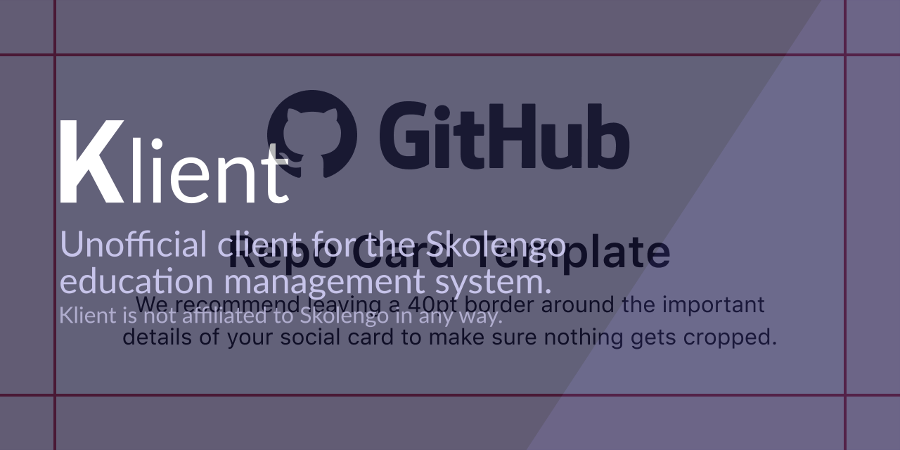

# Kosmos client

## Installing
### Android
Install it direclty from the [Play store](https://play.google.com/store/apps/details?id=de.loicezt.kosmos_client).
Or go to the [Releases](https://github.com/lolocomotive/kosmos_client/releases) page and download the latest version (be sure to select the right achitecture, if you're not sure what that means, just select the file with no specific architecture, which should look like that `kosmos-client-28eef2.apk`)
### iOS
The app is not available on iOS since I don't have a Macbook or an iPhone, which makes it impossible to build the app for iOS. Feel free to implement iOS support if you have the tools required to do so.

## Contributing
Any contributions (Pull requests, feature requests and bug reports) are very welcome!
Be aware that I set my line width to 100 instead of 80, so be careful before refomatting entire files. If you're using vscode put the following in `.vscode/settings.json`.

```json
{
    "dart.lineLength": 100,
    "[dart]": {
        "editor.rulers": [
            100
        ],
    }
}
``` 
### Building 
It's just a normal flutter project (refer to the flutter documentation on how to build). You may encouter issues if you are trying to build without the git repository.

<details>
<summary>Building for release</summary>
You'll need to create android/key.properties with your key's details

```properties
keyAlias=my-key
keyPassword=password123
storeFile=<path>/keystore.jks
storePassword=password123
```
Details on how to create a key are available on the [Android Depelopers website](https://developer.android.com/studio/publish/app-signing#generate-key)

</details>

## Screenshots

| Home                                  | Messages                                      | Timetable                                       |
| ------------------------------------- | --------------------------------------------- | ----------------------------------------------- |
|  |  |  |

## To do

Check out the roadmap at https://trello.com/b/L1KfJf8s/kosmos-client