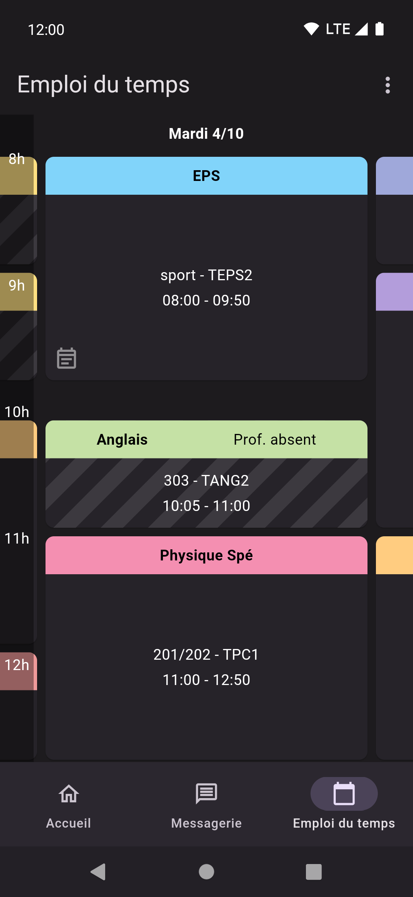

# Klient

## Installing

### Android

Go to the [Releases](https://github.com/lolocomotive/klient/releases) page and download the latest version (be sure to select the right architecture, if you're not sure what that means, just select the file with no specific architecture, which should look like that `klient-28eef2.apk` )

### iOS

The app is not available on iOS since I don't have a Macbook or an iPhone, which makes it impossible to build the app for iOS. Feel free to implement iOS support if you have the tools required to do so.

### Linux

Go to the [Releases](https://github.com/lolocomotive/klient/releases) page. The app is only available for x86_64. You can either choose the AppImage which should work everywhere or the .tar.gz, which is smaller but requires some libraries.
<details>
<summary>Installing the libraries on Ubuntu/Debian</summary>

```bash
sudo apt install  libgtk-3-0 libblkid1 liblzma5 libsqlite3-0 libsqlite3-0-dev webkit2gtk-4.1
```
</details>

### Windows

Go to the [Releases](https://github.com/lolocomotive/klient/releases) page and download and extract the windows zip file. It should work on any x86_64 windows device.

### MacOS

The builds are not available *yet*, I might try to configure github actions to do it for me, since I don't own any Apple devices.

## Contributing

Any contributions (Pull requests, feature requests and bug reports) are very welcome!
Be aware that I set my line width to 100 instead of 80, so be careful before reformatting entire files. If you're using vscode put the following in `.vscode/settings.json` .

```json
{
    "dart.lineLength": 100,
    "[dart]": {
        "editor.rulers": [
            100
        ],
    }
}
```

### Building 

It's just a normal flutter project (refer to the flutter documentation on how to build). You may encounter issues if you are trying to build without the git repository.

<details>
<summary>Building on Android for release</summary>
You'll need to create android/key.properties with your key's details

```properties
keyAlias=my-key
keyPassword=password123
storeFile=<path>/keystore.jks
storePassword=password123
```

Details on how to create a key are available on the [Android Developers website](https://developer.android.com/studio/publish/app-signing#generate-key)

</details>

## Screenshots

| Home                                  | Messages                                      | Timetable                                       |
| ------------------------------------- | --------------------------------------------- | ----------------------------------------------- |
|  |  |  |

## To do

Check out the roadmap at https://trello.com/b/L1KfJf8s/klient
